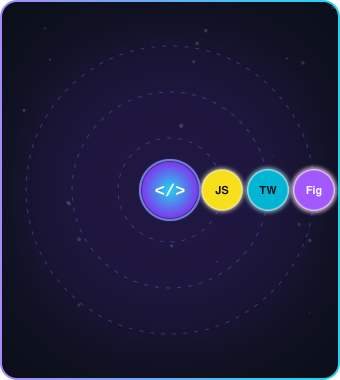
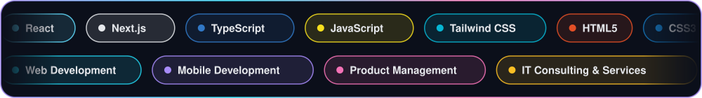

 

  

<h2 align="center">👨‍💻 About Me</h2>

  
  

 

🎓 **Informatics Engineering** graduate · **Brawijaya University**
💡 Passionate about **Web Development · Mobile Development · Product Management**
📈 Enthusiast in **IT Consulting & Services**
🔥 I love building **impactful and scalable web applications**

<h2 align="center">⚡ Tech Arsenal</h2>

  

<h2 align="center">📊 GitHub Stats</h2>

 

  

  

  

<!-- Butuh workflow .github/workflows/snake.yml dijalankan sekali agar animasi ular muncul -->
<picture>
  <source media="(prefers-color-scheme: dark)" srcset="https://raw.githubusercontent.com/adhli-business/adhli-business/output/github-snake-dark.svg">
  
</picture>

<h2 align="center">🌟 Featured Projects</h2>

<!-- Ganti REPO-NAME-1 dan REPO-NAME-2 dengan nama repo pilihanmu, tambah kartu kalau perlu -->

<h2 align="center">📫 Let's Connect</h2>

| 🌐 Portfolio | 📧 Email | 💼 LinkedIn |
| :---: | :---: | :---: |
| [adhlifalah.vercel.app](https://adhlifalah.vercel.app/) | [adhli.falah@gmail.com](mailto:adhli.falah@gmail.com) | [Putra Adhli Falah](https://linkedin.com/in/putra-adhli-falah) |

 

> *"Code is like humor. When you have to explain it, it's bad."* — Cory House

 

